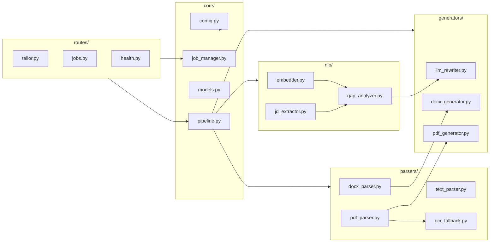
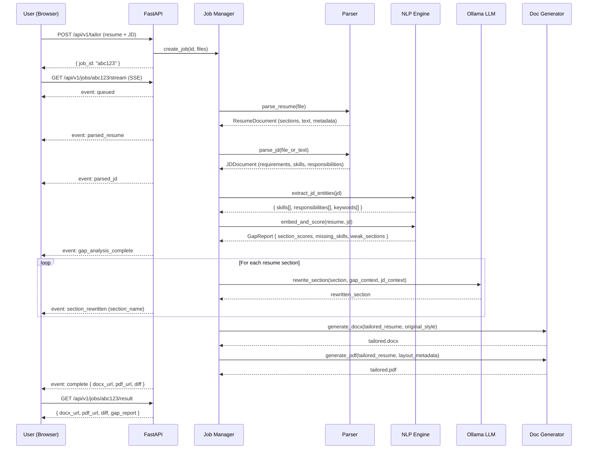
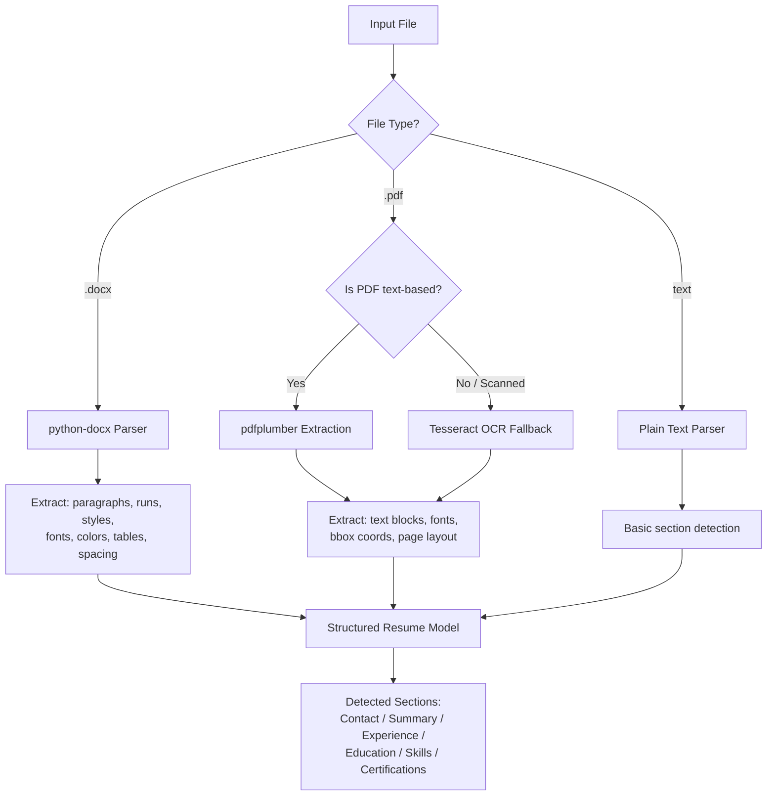
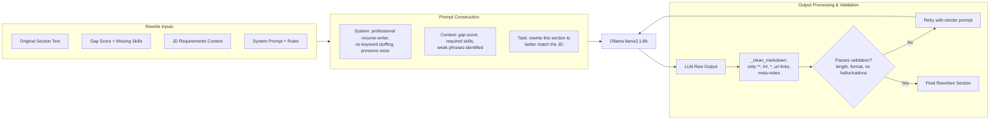
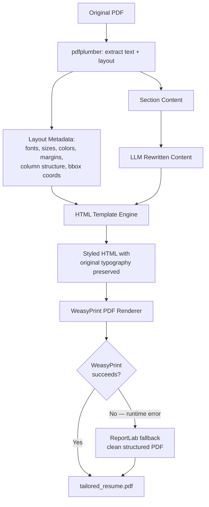
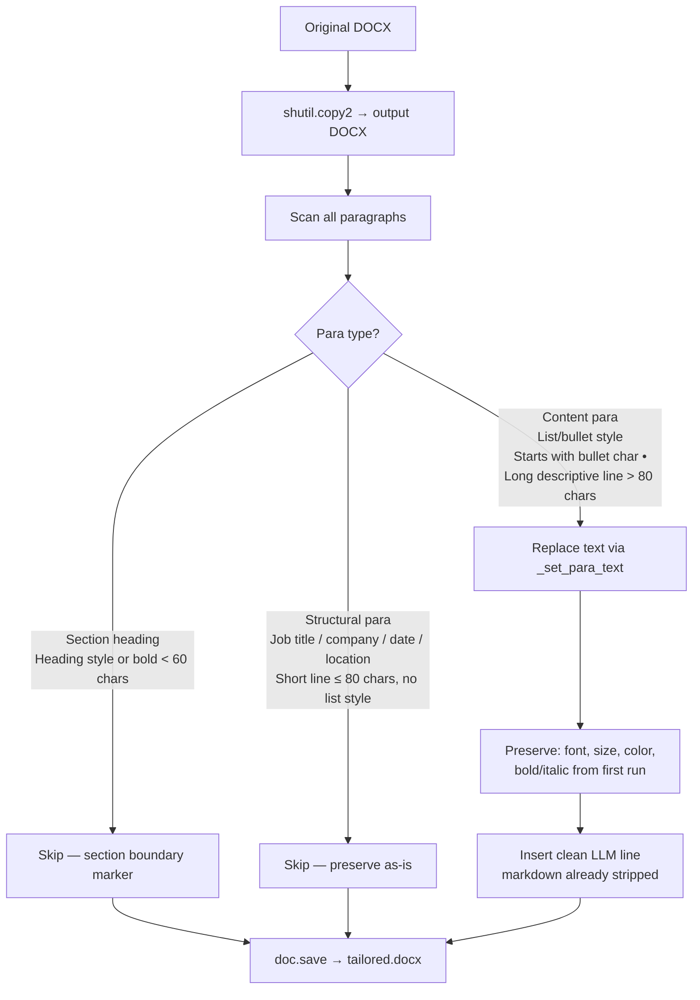
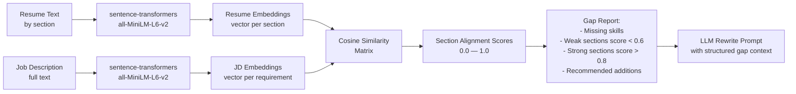
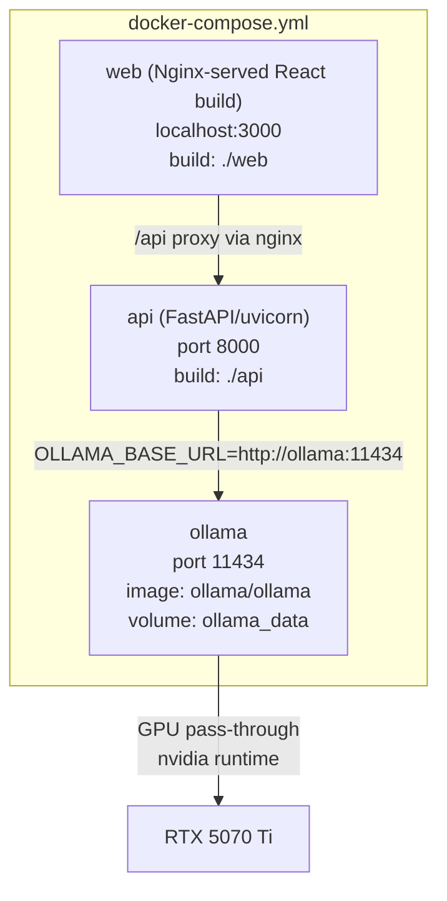

# careerfit-ai — Architecture Documentation

## Overview

careerfit-ai is a locally-hosted, LLM-powered resume tailoring engine. Given a resume (PDF/DOCX) and a job description (PDF/DOCX or plain text), it semantically analyzes both documents, identifies gaps and alignment opportunities, and produces a professionally tailored resume that matches the target role — while preserving the original document's formatting, layout, fonts, colors, and visual identity.

The system runs with local Ollama by default, with no external LLM API dependency in the current codebase. It uses sentence-transformer embeddings for semantic gap scoring, an instruction-tuned local LLM for content rewriting, and WeasyPrint/python-docx for document generation.

---

## System Architecture

```mermaid
graph TB
    subgraph Client ["React SPA (Docker localhost:3000, Vite dev localhost:5173)"]
        UI[Upload UI]
        PROG[SSE Progress Stream]
        DIFF[Side-by-side Diff View]
        DL[Download DOCX + PDF]
    end

    subgraph API ["FastAPI Backend (port 8000)"]
        direction TB
        INGEST["/api/v1/tailor — POST"]
        STREAM["/api/v1/jobs/{id}/stream — SSE"]
        RESULT["/api/v1/jobs/{id}/result — GET"]
        JOB[Job Manager]

        subgraph Pipeline ["Tailoring Pipeline"]
            P1[1. Document Parser]
            P2[2. Semantic Analyzer]
            P3[3. Gap Scorer]
            P4[4. LLM Rewriter]
            P5[5. Document Generator]
        end
    end

    subgraph Models ["Local Model Layer"]
        OLLAMA[Ollama — llama3.1:8b]
        SBERT[sentence-transformers — all-MiniLM-L6-v2]
    end

    subgraph Storage ["File Storage"]
        UPLOADS[/tmp/careerfit_ai/uploads]
        OUTPUTS[/tmp/careerfit_ai/outputs]
    end

    UI -->|multipart/form-data| INGEST
    INGEST --> JOB
    JOB --> P1
    P1 --> P2
    P2 --> P3
    P3 --> P4
    P4 --> P5
    P5 --> OUTPUTS

    PROG -->|EventSource| STREAM
    STREAM --> JOB
    RESULT --> OUTPUTS

    P2 --> SBERT
    P4 --> OLLAMA

    P1 --> UPLOADS
```

---

## Component Architecture



---

## Data Flow — Full Pipeline



---

## Document Parsing Strategy



---

## LLM Rewriting Strategy



---

## PDF Regeneration Strategy



---

## DOCX Modification Strategy



**Key design decisions:**
- Only `_is_content_para()` paragraphs are ever touched — job titles, company names, dates, and locations survive unchanged regardless of resume format
- `_set_para_text()` clears all runs except the first, then sets the first run's text — character formatting (font family, size, colour) is preserved; inline bold within a bullet is intentionally collapsed (acceptable tradeoff for structural fidelity)
- Summary sections with a single content slot join all LLM output lines into one paragraph instead of mapping line-by-line
- If the LLM produces fewer lines than original bullets, excess slots are cleared; if more, extra lines are silently dropped to avoid inserting paragraphs with wrong styles

---

## Semantic Gap Analysis



---

## API Endpoints

| Method | Endpoint | Description |
|--------|----------|-------------|
| `POST` | `/api/v1/tailor` | Submit resume + JD, returns `job_id` |
| `GET` | `/api/v1/jobs/{id}/stream` | SSE stream of pipeline progress events |
| `GET` | `/api/v1/jobs/{id}/result` | Final result with download URLs + diff |
| `DELETE` | `/api/v1/jobs/{id}` | Cleanup job files |
| `GET` | `/api/v1/health` | Health check + Ollama connectivity status |

---

## SSE Event Schema

```json
{ "event": "queued",              "data": { "job_id": "abc123", "position": 1 } }
{ "event": "parsing_resume",      "data": { "progress": 10 } }
{ "event": "parsing_jd",          "data": { "progress": 20 } }
{ "event": "analyzing_gaps",      "data": { "progress": 35 } }
{ "event": "rewriting_summary",   "data": { "progress": 45, "section": "summary" } }
{ "event": "rewriting_experience","data": { "progress": 60, "section": "experience" } }
{ "event": "rewriting_skills",    "data": { "progress": 75, "section": "skills" } }
{ "event": "generating_docx",     "data": { "progress": 85 } }
{ "event": "generating_pdf",      "data": { "progress": 95 } }
{ "event": "complete",            "data": { "progress": 100, "docx_url": "...", "pdf_url": "...", "gap_report": {} } }
{ "event": "error",               "data": { "message": "..." } }
```

---

## Docker Compose Services



---

## Project File Structure

```text
careerfit-ai/
|-- api/
|   |-- main.py                    # FastAPI app entrypoint
|   |-- requirements.txt
|   |-- Dockerfile
|   |-- core/
|   |   |-- config.py              # Settings via pydantic-settings
|   |   |-- models.py              # Pydantic data models
|   |   |-- pipeline.py            # Orchestrates the tailoring pipeline
|   |   `-- job_manager.py         # In-memory job state + SSE queue
|   |-- parsers/
|   |   |-- docx_parser.py         # python-docx resume parser
|   |   |-- pdf_parser.py          # pdfplumber layout-aware parser
|   |   |-- text_parser.py         # Plain text / JD text parser
|   |   `-- ocr_fallback.py        # Tesseract OCR for scanned PDFs
|   |-- nlp/
|   |   |-- embedder.py            # sentence-transformers wrapper
|   |   |-- gap_analyzer.py        # Cosine similarity + gap scoring
|   |   `-- jd_extractor.py        # Extract skills/requirements from JD
|   |-- generators/
|   |   |-- llm_rewriter.py        # Ollama LLM prompt orchestration
|   |   |-- docx_generator.py      # python-docx output with style preservation
|   |   `-- pdf_generator.py       # WeasyPrint PDF generation
|   |-- routes/
|   |   |-- tailor.py              # POST /api/v1/tailor
|   |   |-- jobs.py                # stream, result, download, delete endpoints
|   |   `-- health.py              # Health check
|   `-- utils/
|       `-- logger.py              # Structured logging setup
|-- web/
|   |-- index.html
|   |-- package.json
|   |-- vite.config.js
|   |-- Dockerfile
|   |-- nginx.conf
|   `-- src/
|-- docker-compose.yml
|-- docker-compose.gpu.yml          # GPU override for Ollama
|-- .env.example
|-- README.md
|-- ARCHITECTURE.md
`-- docs/
    `-- prompts.md
```

---

## Technology Stack

| Layer | Technology | Purpose |
|-------|-----------|---------|
| LLM (GPU) | `ollama` + `llama3.1:8b` | Resume rewriting, semantic analysis |
| LLM (CPU) | `ollama` + `qwen2.5:3b` | Fallback for CPU-only machines |
| Embeddings | `sentence-transformers` `all-MiniLM-L6-v2` | Semantic gap scoring |
| PDF parsing | `pdfplumber` | Layout-aware text + metadata extraction |
| PDF generation | `WeasyPrint` + `ReportLab` fallback | HTML → PDF with structured fallback |
| DOCX parsing | `python-docx` | Structure + style extraction |
| DOCX generation | `python-docx` | Format-preserving output |
| OCR | `pytesseract` + `pdf2image` | Scanned PDF fallback |
| API framework | `FastAPI` + `uvicorn` | Async HTTP + SSE |
| Frontend | `React` + `Vite` | SPA with diff view |
| Containerization | `Docker Compose` | Single-command local deployment |
| Config | `pydantic-settings` | Type-safe environment configuration |
| Logging | `structlog` | Structured JSON logging |

---

## Non-Functional Characteristics

- **Privacy-first default**: resume/JD processing uses local services in the Docker Compose setup; no external LLM API is called by the current codebase
- **Ephemeral job state**: job state is held in-memory; uploaded and generated files are removed when a job is deleted or when periodic TTL cleanup expires the job
- **Modular pipeline**: each stage is independently testable and replaceable
- **Graceful degradation**: OCR fallback for scanned PDFs; CPU model if GPU unavailable
- **Extensible**: JD URL scraping, multi-language support, and ATS scoring can be added as pipeline stages without architectural changes
